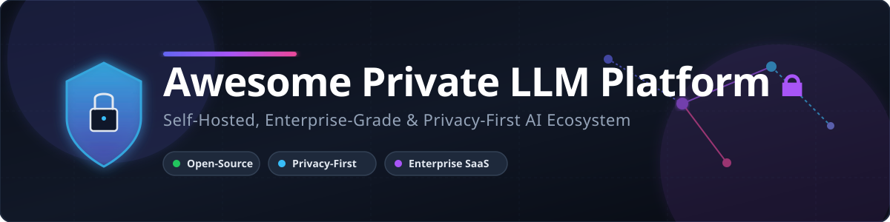

# Awesome-Private-LLM-Platform 🔒

  

  
  
  
  
  

## 🚀 Top Private LLM Platforms

A curated list of leading enterprise platforms and tools for private, secure, and self-hosted large language model (LLM) development, fine-tuning, inference, RAG, and agentic AI.

**Primary focus: open-source software 🔓.**

Commercial / hosted platforms are listed separately with detailed pricing, free trial limits, and company valuation data for completeness. Open-source alternatives and community tools are emphasized throughout.

---

## 🏢 SaaS / Hosted Platforms

| Platform | Description | Key Focus | Company Size (Valuation / Revenue) | Starting Price | Free Tier / Free Trial Limits |
|----------|-------------|-----------|-----------------------------------|----------------|-------------------------------|
| **[NVIDIA AI Enterprise](https://www.nvidia.com/en-us/data-center/products/ai-enterprise/)** | Full-stack software platform with NIM microservices, NeMo tools, optimized inference (vLLM, TensorRT-LLM, Triton), and cloud/edge support. | High-performance inference, microservices, GPU AI | **$5.51 Trillion** (Market Cap) / **$215.9B** Revenue | **$4,500 / GPU / year** ($1/hour/GPU on cloud marketplaces) | **90-day free trial** license (or hands-on access via NVIDIA LaunchPad) |
| **[IBM watsonx.ai](https://www.ibm.com/products/watsonx-ai)** | Integrated studio for building, testing, and scaling enterprise AI. Supports Granite models, agent tooling, RAG, and hybrid deployment. | Enterprise foundation models, RAG, agents, governance | **$250 Billion** (Market Cap) / **$68.3B** Revenue | **$1,110/month** (Standard Plan base) / Pay-as-you-go | **Lite Plan**: 20 Capacity Unit Hours (CUH)/month & 300,000 tokens/month |
| **[Cohere North](https://cohere.com/north)** | Secure AI agent platform for private deployment (VPC, on-prem, air-gapped). Combines LLMs, search, and automation with strict compliance. | Private agentic AI workspace with data sovereignty | **$20.0 Billion** (Valuation) | **$0.0375 per 1M input tokens** (Command R7B starting tier) | **1,000 API calls / month** (Free Trial API key limit) |
| **[SambaNova Suite](https://sambanova.ai/)** | Full-stack LLM platform powered by custom RDUs (SN40L/SN50). Serves massive open-source models with high performance and model ownership. | Hardware-accelerated private inference at scale | **$11.0 Billion** (Valuation) | **$0.10 per 1M tokens** (Base model Developer tier rate) | **$5 free trial credits** valid for 3 months |
| **[Together Enterprise](https://www.together.ai/enterprise)** | Enterprise platform for inference and fine-tuning of open models. Offers serverless/dedicated endpoints, VPC options, and high throughput. | High-performance open-model inference & fine-tuning | **$8.3 Billion** (Valuation) | **$1.49 / GPU hour** (L40) / **$8.00 per 1M training tokens** | **$5 free trial credits** on account creation ($50,000 via Startup Program) |
| **[DataRobot AI Cloud](https://www.datarobot.com/)** | End-to-end AI platform with GenAI playground, LLM gateway (70+ models), RAG, agentic frameworks, observability, and governance. | GenAI experimentation, production governance, multi-model orchestration | **$6.3 Billion** (Valuation) | **$25,000 / year** (Starting enterprise setup/services threshold) | **30-day free trial**: Capped at 15 vector DBs & 1,000 LLM calls |
| **[Writer Enterprise](https://writer.com/)** | Full-stack enterprise generative AI platform with proprietary Palmyra LLMs, Knowledge Graph for company data, and AI Studio for agents. | Brand-aligned content, agents, and knowledge workflows | **$1.9 Billion** (Valuation) | **$29 / user / month** (Starter plan, billed annually) | **14-day free trial** (no credit card required) |
| **[H2O AI Cloud](https://h2o.ai/platform/ai-cloud/)** | End-to-end platform including Driverless AI, H2O-3, LLM Studio, Enterprise h2oGPTe, MLOps, and document AI on Kubernetes. | AutoML + generative AI, private cloud, explainability | **$1.7 Billion** (Valuation) | **$50,000 / year** (Enterprise unit base license) | **90-day free trial** with full platform capabilities |
| **[Anyscale](https://www.anyscale.com/)** | Unified AI compute platform built by creators of Ray. Enables scalable LLM serving (Ray Serve + vLLM), fine-tuning, batch inference, and RAG. | Distributed Ray workloads, production LLM serving & post-training | **$1.65 Billion** (Valuation) | **$0.80 / node hour** (On-demand compute management rate) | **$100 free credits** upon new account registration |
| **[Predibase](https://predibase.com/)** | Platform for fine-tuning and serving open LLMs with private serverless deployments, LoRAX multi-adapter serving, and OpenAI APIs. | Cost-efficient fine-tuning & multi-adapter inference | **$250 Million** (Estimated Valuation) | **$0.0001 / 1K tokens** (Serverless fine-tuned inference) / Pay-as-you-go | **14-day free trial** with **$25 initial free credits** |

---

## 🔓 Open-Source Softwares & Tools

These tools form the core ecosystem for private, self-hosted, and fully controlled LLM development, fine-tuning, inference, RAG, and agentic systems. All software can run entirely on your own infrastructure with zero data leaving your environment.

Sorted by GitHub star count in descending order ⭐.

| Project | Description | Stars | Category / Focus | License |
|---------|-------------|-------|------------------|---------|
| **[Ollama](https://github.com/ollama/ollama)** | Simple, Docker-like tool for running open-source LLMs locally or on servers with an OpenAI-compatible API. |  | Local Runtime & Serving | MIT |
| **[llama.cpp](https://github.com/ggerganov/llama.cpp)** | Highly optimized C/C++ inference engine (GGUF format) for CPU, GPU, and edge devices. |  | C/C++ Inference Engine | MIT |
| **[Dify](https://github.com/langgenius/dify)** | Open-source LLM application development platform with visual workflow builder, RAG, agents, and observability. |  | LLM App Platform & Workflow Builder | AGPL-3.0 |
| **[vLLM](https://github.com/vllm-project/vllm)** | High-throughput, memory-efficient LLM serving engine with PagedAttention, continuous batching, and OpenAI API. |  | High-Throughput Serving Engine | Apache 2.0 |
| **[Unsloth](https://github.com/unslothai/unsloth)** | Fast and memory-efficient fine-tuning library (2× faster fine-tuning, 80% less VRAM usage). |  | Efficient Fine-Tuning | Apache 2.0 |
| **[AnythingLLM](https://github.com/Mintplex-Labs/anything-llm)** | All-in-one desktop and self-hosted AI document chat & private RAG application. |  | Private RAG & Document Chat UI | MIT |
| **[Open WebUI](https://github.com/open-webui/open-webui)** | Feature-rich, self-hosted web interface designed for Ollama, vLLM, and OpenAI-compatible APIs. |  | Self-Hosted Web Interface | MIT |
| **[CrewAI](https://github.com/crewai-inc/crewai)** | Framework for orchestrating role-playing, autonomous AI agents for complex collaborative tasks. |  | Multi-Agent Orchestration | MIT |
| **[Flowise](https://github.com/FlowiseAI/Flowise)** | Drag-and-drop UI node-based builder for constructing custom LLM flows, chains, and agents. |  | Low-Code / No-Code Agent Builder | MIT |
| **[LlamaIndex](https://github.com/run-llama/llama_index)** | Data framework for building context-augmented LLM applications, RAG pipelines, and data agents. |  | RAG & Data Framework | MIT |
| **[Text Generation WebUI](https://github.com/oobabooga/text-generation-webui)** | Gradio-based desktop web interface for running local LLMs (supports Transformers, llama.cpp, ExLlama). |  | Local Desktop Web UI | AGPL-3.0 |
| **[Jan](https://github.com/janhq/jan)** | Open-source alternative to ChatGPT & LM Studio that runs 100% offline on local computers. |  | Local Desktop Assistant | AGPL-3.0 |
| **[DeepSpeed](https://github.com/microsoft/DeepSpeed)** | Deep learning optimization library for extreme scale distributed model training and offloading. |  | Distributed Training & Scaling | Apache 2.0 |
| **[LangGraph](https://github.com/langchain-ai/langgraph)** | Stateful, multi-actor agent orchestration framework with checkpointing, cycle support, and human-in-the-loop. |  | Production Stateful Agents | MIT |
| **[Ray](https://github.com/ray-project/ray)** | Unified distributed computing framework for scaling AI workloads, Ray Serve model inference, and fine-tuning. |  | Distributed Compute & Serving | Apache 2.0 |
| **[LocalAI](https://github.com/mudler/LocalAI)** | Drop-in OpenAI-compatible REST API for local, private inferencing without GPU requirements. |  | OpenAI-Compatible API | MIT |
| **[SGLang](https://github.com/sgl-project/sglang)** | High-performance serving framework with RadixAttention for fast structured generation and agentic workloads. |  | Fast Structured Inference | Apache 2.0 |
| **[TRL (Transformer RL)](https://github.com/huggingface/trl)** | Hugging Face library for post-training alignment, RLHF, DPO, GRPO, and preference optimization. |  | Alignment & Post-Training | Apache 2.0 |
| **[Megatron-LM](https://github.com/NVIDIA/Megatron-LM)** | NVIDIA framework for large-scale GPU training using tensor, pipeline, and sequence parallelism. |  | Frontier-Scale Training | Shell License |
| **[BentoML](https://github.com/bentoml/BentoML)** | Unified model packaging, serving, and deployment framework for building scalable AI microservices. |  | Model Serving & Microservices | Apache 2.0 |
| **[TensorRT-LLM](https://github.com/NVIDIA/TensorRT-LLM)** | NVIDIA library for optimizing LLM inference performance, throughput, and memory footprint on NVIDIA GPUs. |  | GPU-Accelerated Inference | Apache 2.0 |
| **[Axolotl](https://github.com/OpenAccess-AI-Collective/axolotl)** | Config-driven fine-tuning toolkit supporting full fine-tuning, LoRA, QLoRA, and FlashAttention. |  | YAML Config Fine-Tuning | Apache 2.0 |
| **[Phoenix](https://github.com/Arize-ai/phoenix)** | Open-source LLM observability, tracing, evaluation, and prompt engineering workspace by Arize AI. |  | Observability & Evaluation | ELv2 |
| **[SkyPilot](https://github.com/skypilot-org/skypilot)** | Open-source multi-cloud job orchestrator for running AI & LLM workloads across AWS, GCP, Azure, and OCI. |  | Multi-Cloud GPU Orchestrator | Apache 2.0 |
| **[KServe](https://github.com/kserve/kserve)** | Standardized, Kubernetes-native model serving platform supporting scale-to-zero and MLOps workflows. |  | Kubernetes Model Serving | Apache 2.0 |

---

## ⚡ Quick Start Recommendations

| Goal | Recommended Starting Point |
|------|---------------------------|
| 💻 **Simple local / private LLM runtime** | **Ollama** + **Open WebUI** or **Jan** / **LM Studio** |
| ⚡ **Production high-throughput inference** | **vLLM** (or **SGLang** for structured output & agents) |
| 🌐 **Distributed training & serving at scale** | **Ray** + **Anyscale** (or pure open-source Ray) |
| 🎯 **Fast & efficient fine-tuning** | **Unsloth** or **Axolotl** |
| 🤖 **Enterprise private agents & RAG** | **LangGraph** + **LlamaIndex** + **vLLM** / **Dify** |
| ☸️ **Kubernetes-native serving** | **KServe** + **vLLM** |
| 🏎️ **Maximum NVIDIA GPU performance** | **TensorRT-LLM** + **NVIDIA NIM** (or open stack) |
| ☁️ **Full private cloud alternative** | Self-host **vLLM** + **Ray** + **Open WebUI** / **AnythingLLM** |
| 📑 **Private document chat & search** | **AnythingLLM** or **Dify** |

---

## ⭐ Star History

<a href="https://www.star-history.com/?repos=ishandutta2007%2FAwesome-Private-LLM-Platform&type=date&legend=bottom-right">
<picture>
<source media="(prefers-color-scheme: dark)" srcset="https://api.star-history.com/chart?repos=ishandutta2007/Awesome-Private-LLM-Platform&type=date&theme=dark&legend=bottom-right" />
<source media="(prefers-color-scheme: light)" srcset="https://api.star-history.com/chart?repos=ishandutta2007/Awesome-Private-LLM-Platform&type=date&legend=bottom-right" />

</picture>
</a>

---

## 🤝 Contributing

Contributions, corrections, and new open-source projects are welcome!  
Please open an issue or pull request to suggest additions.

---

**Last updated:** August 2026 📅  
Emphasizing open-source tools while documenting major commercial platforms for context.
